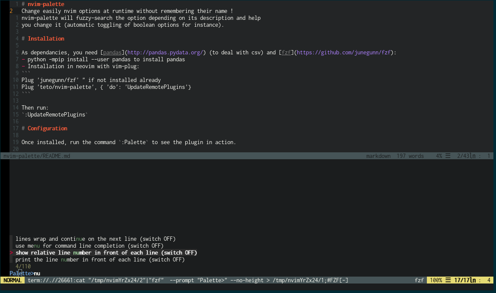

# nvim-palette

Change easily nvim options at runtime without remembering their name !
nvim-palette will fuzzy-search the option depending on its description and help
you change it (automatic toggling of boolean options for instance).




# Installation

This is a remote plugin, it won't work in vim.

As dependancies, you need [pandas](http://pandas.pydata.org/) (to load ./data/options.mpack) and [fzf](https://github.com/junegunn/fzf):
- python -mpip install --user pandas to install pandas 
- Installation in neovim with vim-plug:
```
Plug 'junegunn/fzf' " if not installed already 
Plug 'teto/nvim-palette', { 'do': ':UpdateRemotePlugins'}
```

# Configuration

Once installed, run the command `:Palette` to see the plugin in action.

See `:h palette` for more details.


# Todo

There are many ways to improve the plugin:
 - filter settings according to scope (global/buffer/window). Settings are
 loaded from the file options.mpack generated via [this
 PR](https://github.com/neovim/neovim/pull/6288)
 - accept more entries
 	- List [mappings and their description](https://github.com/neovim/neovim/pull/6236)
	- ~~Add [menu entries](https://github.com/vim/vim/issues/1563) (like those defined for gvim)~~
	- ...and their translations (in runtime/lang/menu_\* for instance. with gettext)
 - optimization, it's a bit of a PoC, performance wasn't a concern
 - work with denite/ctrlp


The entries of the plugin are currently parsed from options.csv, a file generated by some custom scripts parsing neovim's help and options.lua.
One of the objective is to make these scripts/information (setting description) 
	easier to get in general.

# Credits

To vim authors & the fantastic neovim community, very helpful and with great
vision (bfredl, jamessan, justinmk, mhinz etc)
